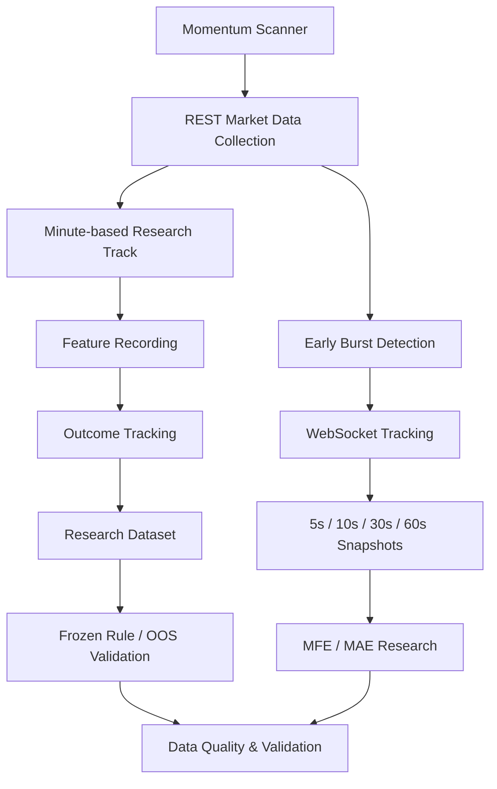

# US Stock Momentum Research

Python 기반으로 미국 주식시장의 급등 종목을 탐색하고, 실시간 시장 데이터를 수집·검증하며 이후 가격 흐름을 연구하기 위해 개발 중인 개인 프로젝트입니다.

현재는 후보 종목 탐색부터 특징값 기록, 관측 이후 가격 추적, 데이터 품질 관리, 별도 OOS(Out-of-Sample) 검증까지 이어지는 연구 파이프라인을 구축하고 있습니다.

단순히 급등 종목을 찾는 것보다 **어떤 시점의 어떤 시장 정보가 이후 가격 움직임과 관계가 있는지 재현 가능한 데이터로 축적하고 검증하는 것**을 핵심 목표로 두고 있습니다.

장기적으로는 충분한 연구와 검증을 거친 뒤 종목 탐색부터 전략 판단, 위험관리, 주문까지 이어지는 자동화 시스템으로 확장하는 것을 목표로 합니다.

> 현재 단계는 연구 및 데이터 검증 단계이며, 저장된 가격 변화율이나 MFE는 실제 체결 수익률을 의미하지 않습니다.

---

## 개발 계기

미국 주식 급등주 거래에 관심이 있었지만, 한국과 미국의 시차로 인해 장시간 시장을 직접 모니터링하는 데 현실적인 제약이 있었습니다.

이후 xSEED Academy에서 LLM을 활용한 웹 프로토타이핑을 경험하며, AI를 단순한 정보 검색 도구가 아니라 실제 아이디어를 구현하는 수단으로 활용하는 방식에 관심을 갖게 되었습니다.

교육 기간에는 주로 사전에 설계된 시나리오 기반의 웹 프로토타입을 제작했기 때문에, 수료 이후에는 실제 외부 데이터와 연결되어 장시간 지속적으로 작동하는 프로그램을 직접 만들어보고 싶었습니다.

이 과정에서 기존에 관심이 있던 주식 기술적 거래와 Python을 결합해, 사람이 계속 시장을 지켜보지 않아도 조건에 맞는 종목을 탐색하고 데이터를 축적할 수 있는 연구 시스템을 개발하게 되었습니다.

---

## 프로젝트 목표

이 프로젝트의 목표는 단순한 종목 추천 프로그램이 아니라 **급격한 가격 변동이 발생하는 종목을 관측하고, 당시의 특징과 이후 움직임을 연결할 수 있는 연구 환경을 구축하는 것**입니다.

이를 위해 다음 문제를 함께 다루고 있습니다.

- 급등 후보 종목의 자동 탐색
- REST API 및 WebSocket 기반 시장 데이터 수집
- 관측 당시의 가격·거래량·단기 모멘텀 등 특징값 기록
- 관측 이후 여러 시점의 가격 움직임 추적
- PRE / REG 세션 경계를 고려한 데이터 처리
- API 호출 제한, timeout, stale data, 결측 및 중복 관리
- 연구용 데이터와 이후 검증용 데이터를 분리한 OOS 검증
- 데이터 수집 실패가 전체 파이프라인을 중단시키지 않도록 하는 복구 구조

---

## 시스템 구성

현재 프로그램은 크게 **분 단위 연구 트랙**과 **초기 급등 종목을 위한 실시간 연구 트랙**으로 구성되어 있습니다.



### Minute-based Research Track

스캐너가 탐지한 종목에 대해 1분 단위 시장 데이터를 수집하고, 관측 당시의 특징값과 이후 가격을 연결합니다.

관측 이후에는 여러 horizon의 가격 움직임을 추적하며, 세션 종료를 넘어서는 측정은 별도로 구분합니다.

연구 과정에서 만든 조건은 Discovery 데이터와 이후 검증 데이터를 구분하기 위해 일정 시점에 동결하고, 이후 새로운 거래일 데이터에서 별도로 검증합니다.

### Early Burst Research Track

일부 급등 종목은 프로그램이 최초로 관측했을 때 이미 매우 빠르게 움직이고 있어 충분한 분 단위 과거 이력이 존재하지 않을 수 있습니다.

이러한 종목을 별도의 연구 대상으로 분리해 WebSocket 기반 실시간 데이터를 수집하고, 짧은 시간대의 움직임을 기록하는 구조를 추가했습니다.

현재 +5초, +10초, +30초, +60초 단위 snapshot과 MFE/MAE를 기록할 수 있도록 구현했으며, 실제 서버 환경에서의 end-to-end 수집 검증을 진행하고 있습니다.

---

## 데이터 검증 방식

실시간 시장 데이터는 항상 완전하게 제공된다고 가정하지 않습니다.

API 제한, 거래가 없는 시간대, 네트워크 지연, stale bar, 요청 실패 등이 분석 결과를 왜곡할 수 있기 때문에 데이터 상태를 구분해서 기록합니다.

예를 들어 다음과 같은 경우를 서로 다른 상태로 처리합니다.

- 정상적으로 관측된 값
- 목표 시점의 정확한 데이터가 없는 경우
- 세션 종료를 넘어 측정할 수 없는 경우
- 오래된 데이터가 반환된 경우
- API 또는 네트워크 오류로 조회하지 못한 경우

누락된 가격을 임의로 0% 수익률로 처리하거나 미래 정보를 이용해 과거 신호를 수정하지 않는 것을 원칙으로 합니다.

---

## 연구와 검증의 분리

초기 데이터에서 발견한 패턴을 같은 데이터에서 반복적으로 조정하면 과최적화될 가능성이 있습니다.

따라서 현재 프로젝트에서는 다음과 같은 방식으로 연구와 검증을 분리하고 있습니다.

```text
Discovery Data
      ↓
Feature / Pattern Analysis
      ↓
Research Rule Definition
      ↓
Rule Freeze
      ↓
New Trading Days
      ↓
Out-of-Sample Validation
```

새로운 OOS 결과가 좋거나 나쁘다는 이유만으로 기존 규칙을 즉시 변경하지 않고, 일정 수준의 표본을 축적한 뒤 별도의 연구 단계에서 다시 검토합니다.

---

## 데이터 수집 안정성

장시간 자동 수집 과정에서는 단순한 분석 로직만큼 데이터 파이프라인의 안정성이 중요했습니다.

현재 프로그램에는 다음과 같은 보호 로직이 포함되어 있습니다.

- REST API 호출 간격 관리
- HTTP 429 및 일시적 네트워크 오류 재시도
- API 실패 종목을 개별적으로 격리
- 다음 Feature 수집 시점을 우선하는 time budget
- stale bar 제외
- 중복 signal 및 outcome 방지
- SQLite 기반 상태 보존
- 재시작 이후 중복 생성 방지
- PRE / REG 세션 경계 처리
- WebSocket 연결 및 재연결 상태 기록

이러한 구조를 통해 일부 종목의 API 요청이 실패하더라도 전체 수집 프로세스가 중단되지 않도록 설계했습니다.

---

## 주요 기술

- Python
- pandas
- requests
- WebSocket
- SQLite
- REST API integration
- Real-time market data processing
- Session-aware time-series processing
- Automated data-quality validation
- Unit / regression testing

---

## 공개 저장소에서 확인할 수 있는 내용

이 저장소는 실제 운용 중인 프로젝트와 분리한 **포트폴리오용 공개 버전**입니다.

민감한 인증정보, 실제 시장 데이터, 핵심 연구 임계값과 매매전략은 포함하지 않습니다.

대신 프로젝트에서 중요하게 다루고 있는 데이터 처리 원칙을 확인할 수 있도록 별도의 합성 데이터 예제를 제공합니다.

현재 공개 예제에서는 다음 과정을 확인할 수 있습니다.

- 중복 관측 제거
- 유효하지 않은 가격 데이터 구분
- 관측 전후 가격 변화율 계산
- 계산에 사용된 데이터와 제외된 데이터 구분
- 기본적인 데이터 품질 요약

예제의 종목명, 시각, 가격은 모두 설명을 위해 만든 합성 값이며 실제 시장 데이터나 운영 데이터의 일부가 아닙니다.

---

## 예제 실행

Python 3.10 이상 환경에서 실행할 수 있으며 Python 3.12 환경에서 실행을 확인했습니다.

```powershell
python src/analyze_sample.py
```

예상 출력은 [실행 결과](docs/demo-output.md), 필드 설명은 [샘플 데이터 설명](docs/sample-data.md)을 참고하세요.

---

## 폴더 구성

```text
us-stock-momentum-research/
├── README.md
├── .gitignore
├── src/
│   └── analyze_sample.py
├── samples/
│   └── synthetic_observations.csv
└── docs/
    ├── sample-data.md
    ├── demo-output.md
    └── engineering-notes.md
```

---

## 공개하지 않는 항목

실제 운영 프로젝트의 다음 항목은 공개 저장소에 포함하지 않습니다.

- API Key / Secret 및 인증정보
- 계좌정보와 access token
- 실제 시장 데이터
- 실제 collector 로그
- SQLite 운영 데이터베이스
- 구체적인 종목 선별 임계값
- 동결된 연구 규칙의 세부 조건
- 주문 및 위험관리 관련 코드
- 실제 운용 코드 전체

---

## 현재 개발 단계

현재는 **데이터 수집 인프라 구축 단계를 넘어, 연구 가설을 실제 신규 데이터에서 검증하는 단계**에 있습니다.

분 단위 연구 트랙에서는 Discovery 데이터와 OOS 데이터를 분리하고, 연구 규칙을 동결한 상태에서 새로운 거래일 데이터를 지속적으로 축적하고 있습니다.

동시에 분 단위 과거 이력이 충분하지 않은 초기 급등 종목을 별도의 WebSocket 기반 Early Burst 연구 트랙으로 분리해 초단위 데이터를 수집하는 구조를 개발하고 있습니다.

현재까지 주요 데이터 수집·검증 로직에 대한 자동화 테스트를 구축했으며, 새로운 기능은 기존 연구 파이프라인과 분리한 상태에서 단계적으로 검증하고 있습니다.

아직 해결해야 할 과제도 남아 있습니다.

- 다양한 시장 환경에서 충분한 OOS 표본 확보
- WebSocket 기반 초단위 연구 데이터의 실서버 검증
- API 및 네트워크 장애 상황에서의 추가적인 안정성 검증
- 실제 체결 가능성을 반영한 진입·청산·슬리피지 모델링
- 충분한 검증 이후의 주문 시스템 및 위험관리 구조 설계

현재 저장된 MFE/MAE와 가격 변화율은 연구용 관측값이며 실제 매매 성과를 의미하지 않습니다.
