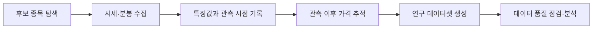

# US Momentum Research

Python 기반으로 미국 주식 급등주를 탐색하고, 실시간 시장 데이터를 수집·분석하기 위해 개발 중인 개인 연구 프로젝트입니다.

현재는 급등 종목의 탐색부터 데이터 수집, 특징값 기록, 관측 이후 가격 추적까지 이어지는 파이프라인을 구축하고 있으며, 축적된 데이터를 바탕으로 매매전략을 연구하고 있습니다. 
최종적으로는 사람이 계속 시장을 모니터링하지 않아도 종목 탐색부터 추적, 전략 판단, 주문까지 수행할 수 있는 자동매매 시스템 구축을 목표로 하고 있습니다. 
실제 자동매매 구현과 수익성 검증은 이후 단계에서 진행할 예정입니다.

## 개발 계기

미국 주식 급등주 거래에 관심이 있었지만, 한국과 미국의 시차로 인해 장시간 시장을 직접 모니터링하는 데 현실적인 제약이 있었습니다.

이후 xSEED Academy에서 LLM을 활용한 웹 프로토타이핑을 경험하며 AI를 아이디어 구현에 활용하는 방식에 관심을 갖게 되었습니다. 
교육 기간에는 주로 사전에 설계된 시나리오를 기반으로 한 웹 프로토타입을 제작했기 때문에, 수료 이후에는 실제 외부 데이터와 연동되어 지속적으로 작동하는 프로그램을 직접 만들어보고 싶었습니다.

AI의 정보처리 능력을 활용할 수 있는 분야를 고민하던 중 기존에 관심이 있던 주식 기술적 거래와 연결하게 되었고, 사람이 계속 시장을 지켜보지 않아도 조건에 맞는 종목을 탐색하고 추적하며, 최종적으로는 정해진 전략에 따라 매매까지 수행할 수 있는 시스템을 목표로 프로젝트를 시작했습니다.

## 프로젝트 목적

미국 주식시장에서 급격한 가격 변동이 발생하는 종목을 탐색하고, 해당 시점의 시장 데이터를 지속적으로 수집해 이후 가격 흐름과의 관계를 분석할 수 있는 연구 환경을 구축하는 것이 목표입니다.
단순히 가격 변화만 기록하는 것이 아니라, 실시간 데이터 수집 과정에서 발생할 수 있는 누락, 관측 지연, 중복 등 데이터 품질 문제도 함께 관리하고 있습니다.

## 시스템 구성

현재 프로그램은 다음과 같은 흐름으로 데이터를 수집하고 분석하도록 구성했습니다.



- REST API 인증 및 시세 조회
- WebSocket 기반 실시간 데이터 수집
- 급등 후보 종목 필터링 및 특징값 기록
- 관측 이후 가격 흐름 추적
- 연구용 데이터셋 생성
- 요청 간격과 수집 작업량을 관리하는 수집 로직
- 데이터 품질 및 분석 결과를 확인하기 위한 테스트 코드

주요 사용 기술은 Python, pandas, requests, websocket-client 등입니다.

## 공개 저장소에서 확인할 수 있는 내용

이 저장소는 실제 운용 중인 프로젝트와 분리한 포트폴리오용 공개 버전입니다.
민감한 인증정보와 핵심 매매전략은 포함하지 않고, 프로젝트의 데이터 처리 구조와 분석 방식을 확인할 수 있도록 별도의 오프라인 데이터 품질 점검 예제를 제공합니다.
공개 예제에서는 합성 데이터를 활용해 다음 과정을 확인할 수 있습니다.

- 중복 관측 제거
- 누락되거나 유효하지 않은 가격 데이터 구분
- 관측 전후 가격 변화율 계산
- 기본적인 데이터 품질 요약

예제의 종목명, 시간, 가격은 모두 설명을 위해 만든 합성 값이며 실제 시장 데이터나 원본 수집 데이터의 일부가 아닙니다.

예제 코드는 Python 3.10 이상에서 실행할 수 있으며, Python 3.12 환경에서 실행을 확인했습니다.

```powershell
python src/analyze_sample.py
```

예상 출력은 [실행 결과](docs/demo-output.md), 필드 설명은 [샘플 데이터 설명](docs/sample-data.md)을 참고하세요.

## 폴더 구성

```text
us-momentum-research-portfolio/
├── README.md
├── .gitignore
├── src/
│   └── analyze_sample.py
├── samples/
│   └── synthetic_observations.csv
└── docs/
    ├── sample-data.md
    ├── demo-output.md
    └── engineering-notes.md
```

## 공개 범위

공개 저장소에는 프로젝트의 전체 구조와 처리 흐름, 독립적으로 작성한 예제 코드, 합성 데이터만 포함했습니다.
다음 항목은 공개하지 않습니다.

- API Key, Secret 등 인증정보
- 계좌정보 및 토큰
- 실제 시장 데이터와 운영 로그
- 종목 선별 조건 및 연구 임계값
- 핵심 매매전략
- 실제 운용 코드
  
## 현재 개발 단계

현재는 실시간 데이터 수집 및 연구용 데이터셋 구축을 중심으로 개발하고 있습니다.
지금까지는 후보 종목 탐색, 실시간 데이터 수집, 특징값 기록, 관측 이후 가격 추적, 장 마감 후 데이터 분석이 가능한 구조를 구축했습니다.

다만 현재 단계에서는 다음과 같은 한계가 있습니다.

- API 요청 제한과 데이터 누락으로 인해 수집 시점과 실제 시장 시점 사이에 차이가 발생할 수 있습니다.
- 관측 이후 가격 변화율은 실제 체결 가능한 매매 수익률과 동일하지 않습니다.
- 거래비용, 슬리피지, 주문 체결 여부는 아직 반영하지 않았습니다.
- 연구 조건 설정에 사용한 데이터와 이후 검증 데이터를 분리한 추가 검증이 필요합니다.

앞으로는 데이터 수집 안정성을 개선하고, 충분한 표본을 축적한 뒤 연구 단계에서 확인한 패턴을 별도의 데이터로 검증하는 과정을 진행할 예정입니다.
