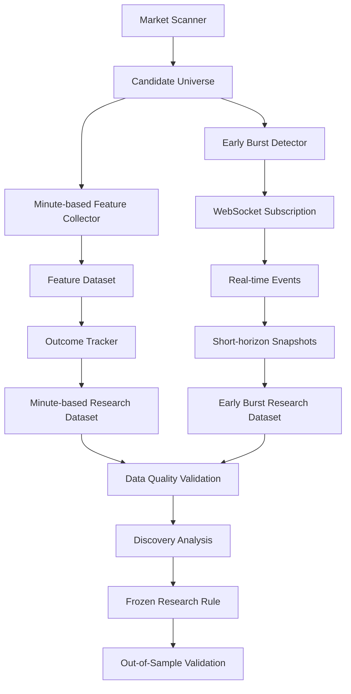

# 시스템 구조

US Stock Momentum Research는 급등 후보 종목을 탐색한 뒤, 해당 시점의 시장 데이터를 기록하고 이후 가격 움직임을 추적하는 연구용 데이터 수집 파이프라인입니다.

프로그램은 하나의 매매 판단 로직에 모든 기능을 묶기보다, 종목 탐색·특징값 수집·후속 가격 추적·초단위 관측·데이터 검증을 서로 다른 역할로 분리하는 방향으로 구성했습니다.

## 전체 구조



## 1. Market Scanner

수집 주기마다 시장에서 가격 변동이 큰 종목을 탐색하고 연구 대상 후보군을 구성합니다.

이 단계의 목적은 매수 종목을 바로 결정하는 것이 아니라, 이후 분석에 필요한 종목을 선별하고 동일한 기준으로 지속적으로 관측하는 것입니다.

스캐너가 반환한 후보는 이후 분 단위 Feature 수집과 필요한 경우 Early Burst 연구 트랙의 입력으로 사용됩니다.

## 2. Minute-based Feature Collector

후보 종목의 시장 데이터를 REST API로 조회하고 관측 시점의 특징값을 기록합니다.

주요 처리 대상은 다음과 같습니다.

- 현재 가격과 일간 가격 변화
- 단기 가격 변화
- 거래량과 거래대금
- 최근 가격 흐름
- 관측 시각
- PRE / REG 세션 정보
- 데이터 freshness 상태

API에서 값이 반환됐더라도 오래된 분봉이거나 유효하지 않은 데이터라면 연구 데이터에서 제외할 수 있도록 상태를 함께 확인합니다.

수집 작업은 일정한 주기를 유지하는 것을 우선하며, 일부 API 요청이 실패하더라도 전체 cycle이 중단되지 않도록 구성했습니다.

## 3. Outcome Tracker

Feature를 기록하는 것만으로는 해당 관측이 이후 가격 움직임과 어떤 관계가 있었는지 알 수 없습니다.

따라서 각 관측 이후 여러 시간 간격의 시장 데이터를 다시 확인해 Feature와 이후 가격 움직임을 연결합니다.

이 과정에서는 단순히 가격 변화율만 기록하지 않고 다음과 같은 상태도 함께 관리합니다.

- 정상적으로 측정된 결과
- 목표 시점의 데이터가 아직 없는 경우
- 데이터 조회 실패
- 세션 종료로 더 이상 측정할 수 없는 경우
- 오래되거나 유효하지 않은 데이터

측정할 수 없는 결과를 임의의 가격 변화로 변환하지 않고 별도의 상태로 보존하는 것을 기본 원칙으로 사용합니다.

## 4. Early Burst Research Track

일부 급등 종목은 프로그램이 처음 발견했을 때 이미 빠르게 상승하고 있어 필요한 분 단위 과거 이력이 충분하지 않을 수 있습니다.

이러한 사례를 기존 분 단위 분석에 억지로 포함하지 않고 별도의 연구 트랙으로 분리했습니다.

조건을 만족하는 연구 대상이 발견되면 WebSocket을 이용해 이후 실시간 이벤트를 관측하고 짧은 시간 단위의 snapshot을 생성하도록 설계했습니다.

현재 구조에서는 다음과 같은 짧은 horizon을 관측할 수 있습니다.

- +5초
- +10초
- +30초
- +60초

각 구간에서는 가격 변화뿐 아니라 관측 구간 내 최대·최소 움직임을 이용한 MFE와 MAE도 연구할 수 있도록 구성하고 있습니다.

이 기능은 기존 분 단위 연구 트랙과 독립적으로 운영하며, 실서버 환경에서 단계적으로 검증하고 있습니다.

## 5. REST API와 WebSocket의 역할 분리

프로젝트에서는 REST API와 WebSocket을 서로 다른 목적으로 사용합니다.

REST API는 후보 탐색과 분봉 기반 Feature·Outcome 수집에 사용하며, WebSocket은 짧은 시간 동안 발생하는 실시간 이벤트를 관측하는 데 사용합니다.

```text
REST API
 ├─ 후보 탐색
 ├─ 분봉 조회
 ├─ Feature 계산
 └─ 분 단위 Outcome 추적

WebSocket
 └─ Early Burst 대상
     ├─ 실시간 이벤트 수신
     ├─ 초단위 Snapshot
     └─ MFE / MAE 관측
```

모든 종목을 WebSocket으로 계속 수집하기보다 연구 목적에 필요한 대상만 별도로 추적하는 구조를 사용하고 있습니다.

## 6. 데이터 품질 관리

시장 데이터 수집에서는 API 응답 성공 여부만으로 데이터 품질을 판단하지 않습니다.

다음과 같은 문제를 각각 구분해서 처리합니다.

- API rate limit
- timeout 및 일시적인 연결 오류
- stale bar
- 중복 관측
- 중간 시계열 누락
- 세션 경계
- 재시작 이후 중복 처리
- 목표 시점의 데이터 부재

가능한 한 실제 시장 움직임과 데이터 수집 과정에서 발생한 문제를 분리해 기록하는 것이 목적입니다.

## 7. 상태 저장

연구 데이터는 분석하기 쉬운 CSV와 상태 관리에 적합한 SQLite를 목적에 따라 함께 사용합니다.

```text
CSV
 ├─ Feature 확인
 ├─ Outcome 분석
 ├─ 일별 결과 확인
 └─ 연구 데이터 분석

SQLite
 ├─ 처리 상태 보존
 ├─ 중복 방지
 ├─ 실시간 이벤트 기록
 └─ 재시작 이후 상태 복원
```

프로그램이 재시작되더라도 이미 처리된 연구 대상이 다시 최초 신호로 생성되지 않도록 식별 정보를 보존합니다.

## 8. Discovery와 OOS 검증

데이터 수집 이후의 연구에서도 패턴 탐색과 실제 검증을 구분합니다.

```text
Collected Data
      ↓
Discovery
      ↓
Hypothesis / Rule
      ↓
Rule Freeze
      ↓
New Data
      ↓
Out-of-Sample Validation
```

Discovery 데이터에서 발견한 조건은 일정 시점에 동결하고, 이후 새롭게 수집되는 데이터를 이용해 별도로 검증합니다.

새로운 결과를 확인할 때마다 과거 규칙을 수정하면 검증 데이터가 다시 연구 데이터가 될 수 있기 때문에, OOS 기간에는 기존 규칙을 유지하는 것을 원칙으로 합니다.

## 9. 현재 개발 범위

현재 프로젝트는 실거래 자동매매 시스템이 아니라 데이터 수집과 전략 연구를 위한 단계입니다.

현재 구현 또는 검증 중인 범위는 다음과 같습니다.

- 급등 후보 종목 자동 탐색
- PRE / REG 시장 데이터 수집
- 분 단위 Feature 기록
- 여러 horizon의 Outcome 추적
- 데이터 품질 상태 관리
- Discovery / OOS 분리
- 연구 규칙 동결 및 신규 데이터 검증
- WebSocket 기반 Early Burst 연구
- 재시작 및 일부 장애 상황에 대한 상태 복구
- 주요 로직의 unit / regression test

주문 체결, 실제 슬리피지, 거래비용, 포지션 관리와 같은 실거래 요소는 충분한 데이터 연구와 검증 이후의 단계로 두고 있습니다.

## 공개 저장소와 운영 프로젝트

이 공개 저장소는 실제 운영 프로젝트의 구조와 개발 과정 자체를 설명하기 위한 포트폴리오 버전입니다.

따라서 다음 내용은 공개 버전에 포함하지 않습니다.

- 실제 API 인증정보
- 계좌 및 주문 관련 정보
- 실제 시장 원본 데이터
- 운영 로그와 데이터베이스
- 구체적인 연구 임계값
- 동결된 전략의 상세 조건
- 전체 운영 소스코드

공개 문서와 합성 데이터는 실제 프로그램에서 다룬 문제와 설계 방식을 설명하기 위한 목적으로 구성했습니다.
